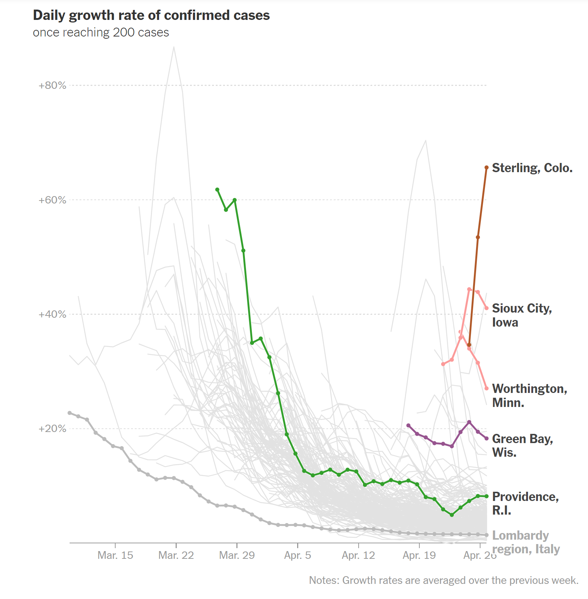
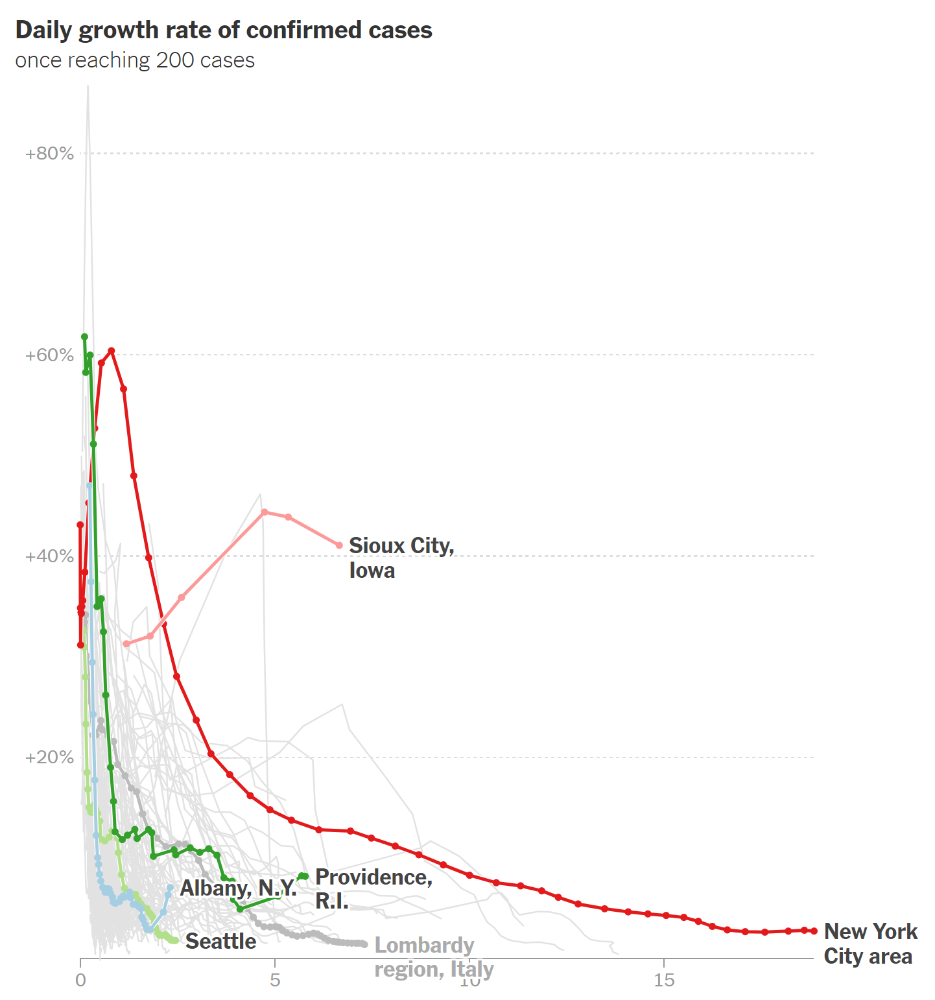

```{r setup, include=FALSE}
knitr::opts_chunk$set(echo=FALSE, 
                      comment=NA, 
                      warning=FALSE, 
                      message=FALSE, 
                      # cache = TRUE, 
                      fig.pos="H",
                      fig.width = 12)

library(tidyverse)
library(purrr)
library(lubridate)
library(zoo)
library(readxl)
library(maps)
library(sf)
library(plotly)
library(shiny)

# extra packages required by 'sf'
library(rgeos)
library(maptools)

```

<style>

.center-mid {
  position:          relative;
  top:               50%;
  transform:         translateY(30%);
}

.center-left {
  position:          relative;
  top:               50%;
  transform:         translateY(30%);
}
.center-right {
  position:          relative;
  top:               50%;
  transform:         translateY(30%);
}

</style>

# COVID-19

[Headline]

---

# COVID-19 Data Visualizations

[Screen Grab: FT, JHU, etc. (look at AFI DSI COVID-19 website)]

---

# New York Times Data Visualizations

<!-- [Screen Grab] -->
.pull-left[
  <center>
    
  
  </center>
]

.pull-right[
  <center>
    
    
  </center>
  <div style="width:300; word-wrap: break-word;">
    <https://www.nytimes.com/interactive/2020/04/03/upshot/coronavirus-metro-area-tracker.html>
  </div>
]

---
class: inverse 

# AFI DSI COVID-19 Research Group

.kinda-big-text[

  "*Wisconsin leaders need information about the extent and impact of COVID-19 to make good decisions.*" - [AFI DSI COVID-19 Research Group Charter](https://datascience.wisc.edu/covid19/covid19_charter/)
  
  **Project Idea**: "*Can we add value with visualizations of growth rates in Wisconsin metro areas?*" - [Steve Goldstein](https://biostat.wiscweb.wisc.edu/staff/goldstein-steve/)
  
  **Audience**: 
  - Wisconsin Public Health Officials
  - Health System Officials
  - Interested modelers and citizens

]


???

[Collaborator]

[Audience]

Goal: [Goal]

---

# Data Sources

.big-text[
- New York Times Database of U.S. Coronavirus Cases
- Corona Data Scraper Timeseries
- United States Census Bureau:
  - County Population Totals
  - Delineation Files
  - Cartographic Boundary Files
]


???

- Delineation files are for the geographic metro/micro regions (by county for aggregation)

---

# Exponential Spread of COVID-19

```{r}
## Data choices
MIN_CASES_TO_PLOT <- 30
MIN_DATE <- Sys.Date() - 28 # last 4 weeks
MAX_DATE <- Sys.Date()

color_palette <- c(RColorBrewer::brewer.pal(21, "Paired"), rep("grey50", 20))
```

```{r}
# Data from the New York Times repository
us_counties <- read_csv("https://raw.githubusercontent.com/nytimes/covid-19-data/master/us-counties.csv")
us_states <- read_csv("https://raw.githubusercontent.com/nytimes/covid-19-data/master/us-states.csv")

# NYT does this annoying thing where they count ("Kings", "Queens", "New York", "Bronx") counties 
# as the 'county' New York City.  Attempt to fix by removing putting all of the cases/deaths in 
# New York county, since we are aggregating by metro area anyways
us_counties[us_counties$county == "New York City", "county"] <- "New York"

```

```{r}
## Population data from US census 2019 estimates
county_population <- 
  read_csv("https://www2.census.gov/programs-surveys/popest/datasets/2010-2019/counties/totals/co-est2019-alldata.csv") %>% 
  filter(SUMLEV == "050") %>% 
  mutate(CTYNAME = str_remove(CTYNAME, " County"),
         CTYNAME = str_remove(CTYNAME, " Parish")) %>% 
  rename(state = STNAME,
         county = CTYNAME,
         population = POPESTIMATE2019) %>% 
  select(state, county, population)

```

```{r}
## Census core based statistical area data
temp <- tempfile(fileext = ".xls")
url <- "https://www2.census.gov/programs-surveys/metro-micro/geographies/reference-files/2018/delineation-files/list1_Sep_2018.xls"
download.file(url, destfile = temp, mode = "wb")

metro <- 
  read_xls(temp, skip = 2) %>% 
  mutate(`County/County Equivalent` = str_remove(`County/County Equivalent`, " County"),
         `County/County Equivalent` = str_remove(`County/County Equivalent`, " Parish")) %>% 
  rename(state = `State Name`,
         county = `County/County Equivalent`,
         metro = `CBSA Title`,
         area_type = `Metropolitan/Micropolitan Statistical Area`) %>% 
  select(state, county, metro, area_type)

## Total population by CBSA
metro_population <- 
  county_population %>% 
  left_join(metro, by = c("state", "county")) %>% 
  # metro %>% 
  # left_join(county_population, by = c("state", "county")) %>% 
  group_by(metro) %>% 
  mutate(population = sum(population, na.rm = TRUE)) %>% 
  ungroup()

```

```{r}
## Sum county totals by metro area
us_metro <- 
  us_counties %>% 
  left_join(metro_population, by = c("state", "county")) %>% 
  group_by(metro, date) %>%
  summarize(cases = sum(cases, na.rm = TRUE),
            deaths = sum(deaths, na.rm = TRUE),
            population = max(population, na.rm = TRUE)) %>% 
  ungroup() 

us_metro <- 
  us_metro %>% 
  mutate(metro_name = case_when(
    metro == "Chicago-Naperville-Elgin, IL-IN-WI" ~ "Chicago", 
    metro == "Minneapolis-St. Paul-Bloomington, MN-WI" ~ "Minneapolis", 
    metro == "Milwaukee-Waukesha, WI" ~ "Milwaukee, WI", 
    metro == "Madison, WI"  ~ "Madison, WI",
    metro == "Green Bay, WI" ~ "Green Bay, WI",
    metro == "Duluth, MN-WI" ~ "Duluth, MN-WI",
    metro == "Appleton, WI" ~ "Appleton, WI",
    metro == "Racine, WI" ~ "Racine, WI",
    metro == "Oshkosh-Neenah, WI" ~ "Oshkosh-Neenah, WI",
    metro == "Eau Claire, WI" ~ "Eau Claire, WI",
    metro == "Janesville-Beloit, WI" ~ "Janesville-Beloit, WI",
    metro == "Wausau-Weston, WI" ~ "Wausau-Weston, WI",
    metro == "La Crosse-Onalaska, WI-MN" ~ "La Crosse-Onalaska, WI-MN",
    metro == "Sheboygan, WI" ~ "Sheboygan, WI",
    metro == "Fond du Lac, WI" ~ "Fond du Lac, WI",
    metro == "New York-Newark-Jersey City, NY-NJ-PA" ~ "New York",
    metro == "New Orleans-Metairie, LA" ~ "New Orleans",
    TRUE ~ NA_character_
  ))

# Note: this has problems with Kansas City, MO, Dona Ana, NM, and "Unknown" counties
# These aren't currently relevant to the analysis

```

```{r}
wi_metro_population <- 
  metro_population %>% 
  filter(state == "Wisconsin", str_detect(area_type, "Metropolitan")) %>% 
  select(metro, population) %>% 
  unique() %>% 
  arrange(desc(population))

```

```{r}
## Data from Corona Data Scraper on Lombardy and Hubei regions
temp <- tempfile()
download.file("https://coronadatascraper.com/timeseries-tidy.csv.zip", temp)

other_metro <-
  read.csv(unz(temp, "timeseries-tidy.csv")) %>%
  as_tibble() %>% 
  filter((country == "Italy" & state == "Lombardy") | (country == "China" & state == "Hubei"),
         type %in% c("cases", "deaths")) %>% 
  pivot_wider(names_from = "type",
              values_from = "value") %>% 
  mutate(metro_name = name) %>% 
  select(metro = name, date, cases, deaths, population, metro_name) 

```

```{r}
plot_data <-
  rbind(us_metro) %>% 
  filter(!is.na(metro_name)) %>% 
  group_by(metro) %>% 
  arrange(date) %>% 
  mutate(doubling.time = round(7*log10(2)/log10(cases/lag(cases, n = 7,  default = NA)), 2)) %>% 
  ungroup() %>% 
  filter(cases > 10) %>% 
  group_by(metro) %>% 
  arrange(date) %>% 
  mutate(days.since = row_number()-1) %>% 
  ungroup() %>% 
  rename(`Days Since 10 Cumulative Cases` = days.since,
         `Doubling Time` = doubling.time,
         Name = metro,
         Date = date,
         Cases = cases)

max.x <- plot_data %>% 
  summarize(max.x = max(`Days Since 10 Cumulative Cases`),
            max.y = max(Cases)) %>% 
  pull(max.x)

plot_doubling_times <- tibble(
  name = as.character(rep(paste0(2:6," days"), each = max.x + 1)), 
  day = rep(0:max.x, 5),
  x = rep(2:6, each = max.x + 1),
  y = 10*2^(1/x*day)
)

fig1 <- plot_ly(data = plot_data,
                x = ~`Days Since 10 Cumulative Cases`,
                y = ~Cases,
                color = ~metro_name,
                text = ~paste0("</br>", metro_name,
                               "</br>", Date,
                               "</br>Days Since 10 Cumulative Cases: ", `Days Since 10 Cumulative Cases`,
                               "</br>Doubling Time: ", `Doubling Time`, " days"),
                type = "scatter",
                mode = 'lines+markers',
                colors = "Paired",
                alpha = 0.7,
                hoverinfo = "text") %>% 
  layout(xaxis = list(title = "Days Since 10 Cumulative Cases",
                      zeroline = FALSE,
                      showline = FALSE,
                      showgrid = FALSE),
         yaxis = list(zeroline = FALSE,
                      showline = FALSE,
                      showgrid = FALSE)) %>% 
  add_trace(data = plot_doubling_times, 
            x= ~day,
            y = ~y,
            group = ~name,
            text = ~paste0("</br>Doubling Time: ", name),
            type = "scatter",
            mode = 'lines',
            color = I("gray90"),
            alpha = 0.7,
            hoverinfo = "text", 
            showlegend = FALSE) %>% 
  layout(xaxis = list(title = "Days Since 10 Cumulative Cases",
                      showgrid = FALSE),
         yaxis = list(type = "log",
                      range = c(1,6),
                      # tickformat = "f",
                      dtick = 1))

fig1

```

---

# Growth Rate

.big-text[
Calculate [compound daily growth rate](https://en.wikipedia.org/wiki/Compound_annual_growth_rate):
]

\begin{equation}
\textrm{avg daily change}_t =  \left( \frac{\textrm{cases}_t}{\textrm{cases}_{t-7}} \right)^{(1/7)} - 1 
\end{equation}


.big-text[
Captures the <span style="color: #FF1B70;">relative spread</span> of Cornoavirus

Averaged over last 7 days

]


???

- Not an exact match to NYT visualizations, but was pretty close
- Averaged to account for changes in test results over weekends 
- Highly volatile for areas with small case counts, only plot those with >30 cases 

```{r data choices}
## Data choices
MIN_CASES_TO_PLOT <- 30
MIN_DATE <- Sys.Date() - 28 # last 4 weeks
MAX_DATE <- Sys.Date()
color_palette <- c(RColorBrewer::brewer.pal(12, "Paired"), rep("grey50", 20))
```

```{r nyt-data}
# Data from the New York Times repository
us_counties <- read_csv("https://raw.githubusercontent.com/nytimes/covid-19-data/master/us-counties.csv")
us_states <- read_csv("https://raw.githubusercontent.com/nytimes/covid-19-data/master/us-states.csv")
# NYT does this annoying thing where they count ("Kings", "Queens", "New York", "Bronx") counties 
# as the 'county' New York City.  Attempt to fix by removing putting all of the cases/deaths in 
# New York county, since we are aggregating by metro area anyways
us_counties[us_counties$county == "New York City", "county"] <- "New York"
```

```{r population-data}
## Population data from US census 2019 estimates
county_population <- 
  read_csv("https://www2.census.gov/programs-surveys/popest/datasets/2010-2019/counties/totals/co-est2019-alldata.csv") %>% 
  filter(SUMLEV == "050") %>% 
  mutate(CTYNAME = str_remove(CTYNAME, " County"),
         CTYNAME = str_remove(CTYNAME, " Parish")) %>% 
  rename(state = STNAME,
         county = CTYNAME,
         population = POPESTIMATE2019) %>% 
  select(state, county, population)
```

```{r metro-data}
## Census core based statistical area data
temp <- tempfile(fileext = ".xls")
url <- "https://www2.census.gov/programs-surveys/metro-micro/geographies/reference-files/2018/delineation-files/list1_Sep_2018.xls"
download.file(url, destfile = temp, mode = "wb")
metro <- 
  read_xls(temp, skip = 2) %>% 
  mutate(`County/County Equivalent` = str_remove(`County/County Equivalent`, " County"),
         `County/County Equivalent` = str_remove(`County/County Equivalent`, " Parish")) %>% 
  rename(state = `State Name`,
         county = `County/County Equivalent`,
         metro = `CBSA Title`,
         area_type = `Metropolitan/Micropolitan Statistical Area`) %>% 
  select(state, county, metro, area_type)
## Total population by CBSA
metro_pop <- 
  county_population %>% 
  left_join(metro, by = c("state", "county")) %>% 
  # metro %>% 
  # left_join(county_population, by = c("state", "county")) %>% 
  group_by(metro) %>% 
  mutate(metro_population = sum(population, na.rm = TRUE)) %>% 
  ungroup()
```

```{r combine-data}
## Sum county totals by metro area
us_metroarea <- 
  us_counties %>% 
  left_join(metro_pop, by = c("state", "county")) %>% 
  group_by(metro, date) %>%
  summarize(cases = sum(cases, na.rm = TRUE),
            deaths = sum(deaths, na.rm = TRUE),
            population = max(metro_population, na.rm = TRUE)) %>% 
  ungroup() 
us_metroarea <- 
  us_metroarea %>% 
  mutate(metro_name = case_when(
    metro == "Chicago-Naperville-Elgin, IL-IN-WI" ~ "Chicago", 
    metro == "Minneapolis-St. Paul-Bloomington, MN-WI" ~ "Minneapolis", 
    metro == "Milwaukee-Waukesha, WI" ~ "Milwaukee, WI", 
    metro == "Madison, WI"  ~ "Madison, WI",
    metro == "Green Bay, WI" ~ "Green Bay, WI",
    metro == "Duluth, MN-WI" ~ "Duluth, MN-WI",
    metro == "Appleton, WI" ~ "Appleton, WI",
    metro == "Racine, WI" ~ "Racine, WI",
    metro == "Oshkosh-Neenah, WI" ~ "Oshkosh-Neenah, WI",
    metro == "Eau Claire, WI" ~ "Eau Claire, WI",
    metro == "Janesville-Beloit, WI" ~ "Janesville-Beloit, WI",
    metro == "Wausau-Weston, WI" ~ "Wausau-Weston, WI",
    metro == "La Crosse-Onalaska, WI-MN" ~ "La Crosse-Onalaska, WI-MN",
    metro == "Sheboygan, WI" ~ "Sheboygan, WI",
    metro == "Fond du Lac, WI" ~ "Fond du Lac, WI",
    metro == "New York-Newark-Jersey City, NY-NJ-PA" ~ "New York",
    metro == "New Orleans-Metairie, LA" ~ "New Orleans",
    TRUE ~ NA_character_
  ))
# Note: this has problems with Kansas City, MO, Dona Ana, NM, and "Unknown" counties
# These aren't currently relevant to the analysis
```

```{r county-map-data}
county <- 
  maps::map("county", plot = FALSE, fill = TRUE) %>% 
  sf::st_as_sf() %>% 
  separate(ID, c("state", "county"), ",") %>% 
  mutate(state = tools::toTitleCase(state),
         county = tools::toTitleCase(county)) 
us_counties_current_date <- 
  us_counties %>% 
  filter(date == max(date))
us_metro_current_date <- 
  us_counties %>% 
  left_join(metro_pop, by = c("state", "county")) %>% 
  filter(date == max(date))
```

```{r wi-metro}
wi_metro_areas <- 
  metro_pop %>% 
  filter(state == "Wisconsin", str_detect(area_type, "Metropolitan")) %>% 
  select(metro, metro_population) %>% 
  unique() %>% 
  arrange(desc(metro_population))
```

```{r cds-data-world}
## Data from Corona Data Scraper on Lombardy and Hubei regions
temp <- tempfile()
download.file("https://coronadatascraper.com/timeseries-tidy.csv.zip", temp)
other_metroarea <-
  read.csv(unz(temp, "timeseries-tidy.csv")) %>% 
  # read.csv("https://coronadatascraper.com/timeseries-tidy.csv") %>% 
  as_tibble() %>% 
  filter((country == "Italy" & state == "Lombardy") | (country == "China" & state == "Hubei"),
         type %in% c("cases", "deaths")) %>% 
  pivot_wider(names_from = "type",
              values_from = "value") %>% 
  mutate(metro_name = name) %>% 
  select(metro = name, date, cases, deaths, population, metro_name) 
```

---

# Daily Growth Rate

```{r}
## Daily growth rate chart
plot_data <-
  rbind(us_metroarea,
        other_metroarea) %>% 
  filter(!is.na(metro_name)) %>% 
  group_by(metro) %>% 
  mutate(daily.change = (cases / lag(cases, n = 7, default = NA))^(1 / 7) - 1 ) %>% 
  ungroup() %>% 
  mutate(`Average Daily Change (Last 7 Days)` = daily.change) %>% 
  mutate(`Average Daily Change (Last 7 Days)` = ifelse(is.nan(`Average Daily Change (Last 7 Days)`), 0, `Average Daily Change (Last 7 Days)`)) %>% 
  rename(Name = metro,
         Date = date,
         Cases = cases) %>% 
  filter(Cases > MIN_CASES_TO_PLOT) %>% 
  filter(between(Date, MIN_DATE, MAX_DATE)) # for comparison

plot_data_ends <-
  plot_data %>% 
  filter(!is.na(daily.change)) %>%
  # filter(!str_detect(metro_name, "WI")) %>% 
  group_by(Name) %>% 
  top_n(1, Date) 

fig1 <- plot_ly(data = plot_data,
               x = ~Date,
               y = ~`Average Daily Change (Last 7 Days)`,
               color = ~metro_name,
               # symbol = ~str_detect(metro_name, "WI"),
               text = ~paste0("</br>", metro_name,
                             "</br>", Date,
                             "</br>Cases: ", Cases,
                             "</br>Daily Change: ", scales::percent(daily.change, accuracy = 0.1)),
               type = "scatter",
               mode = 'lines+markers',
               colors = "Paired",
               alpha = 0.7,
               hoverinfo = "text") %>% 
  layout(title = "") %>% 
  layout(yaxis = list(title = "Average Daily Change (Last 7 Days)",
                      range = c(0, 1),
                      tickformat = "%")) 

fig1

```

---

# Growth Rates by Case Count

```{r}
## Growth Rates by Case Count
plot_data <-
  rbind(us_metroarea,
        other_metroarea) %>% 
  filter(!is.na(metro_name)) %>% 
  group_by(metro) %>% 
  mutate(daily.change = (cases / lag(cases, n = 7, default = NA))^(1 / 7) - 1 ) %>% 
  ungroup() %>% 
  # mutate(`Average Daily Change (Last 7 Days)` = round(roll.cases/cases/7*100,2)) %>% 
  mutate(`Average Daily Change (Last 7 Days)` = daily.change) %>% 
  mutate(`Average Daily Change (Last 7 Days)` = ifelse(is.nan(`Average Daily Change (Last 7 Days)`), 0, `Average Daily Change (Last 7 Days)`)) %>% 
  mutate(`Confirmed Cases Per Thousand People` = cases / population * 1000) %>% 
  rename(Name = metro,
         Date = date,
         Cases = cases) %>% 
  filter(Cases > MIN_CASES_TO_PLOT) 

plot_data_ends <-
  plot_data %>%
  group_by(Name) %>%
  top_n(1, Date) 

fig2 <- plot_ly(data = plot_data,
               x = ~`Confirmed Cases Per Thousand People`,
               y = ~`Average Daily Change (Last 7 Days)`,
               color = ~metro_name,
               # symbol = ~str_detect(metro_name, "WI"),
               text = ~paste0("</br>", metro_name,
                             "</br>", Date,
                             "</br>Cases Per Thousand: ",
                             round(`Confirmed Cases Per Thousand People`, 3), 
                             "</br>Daily Change: ", scales::percent(daily.change, accuracy = 0.1)),
               type = "scatter",
               mode = 'lines+markers',
               colors = "Paired",
               # alpha = 0.5,
               hoverinfo = "text") %>% 
  layout(title = "") %>% 
  layout(xaxis = list(title = "Confirmed Cases Per Thousand People"),
         yaxis = list(title = "Average Daily Change (Last 7 Days)",
                      range = c(0, 1),
                      tickformat = "%")) 

fig2

```

---

# Maps of Metro Areas

```{r}
## US Metro Map (Cases)
fig3 <- county %>%
  left_join(us_metro_current_date, by = c("state", "county")) %>%
  # left_join(county_population, by = c("state", "county")) %>% 
  # filter(!is.na(metro)) %>%
  group_by(metro) %>%
  summarize(cases = sum(cases, na.rm = TRUE),
            deaths = sum(deaths, na.rm = TRUE),
            population = max(metro_population, na.rm = TRUE),
            geometry = sf::st_union(sf::st_buffer(geometry,0.0))) %>% 
  ungroup() %>%
  mutate(metro = ifelse(is.na(metro), "Rest of United States", metro)) %>%
  mutate(cases.per.1000 = round(cases / (population / 1000), 3),
         cases.per.1000.tool.tip = cases.per.1000,
         cases.per.1000 = ifelse(cases.per.1000<=0.025, NA, cases.per.1000),
         cases.per.1000 = ifelse(metro=="Rest of United States", NA, cases.per.1000)) %>% 
  mutate(cases.per.1000 = cut(cases.per.1000,
                              c(min(cases.per.1000, na.rm = TRUE), 0.1, 0.25, 0.5, 1, 2, 4, max(cases.per.1000, na.rm = TRUE)))) %>%
  sf::st_transform(crs = "+proj=aea +lat_1=25 +lat_2=50 +lon_0=-100") %>% 
  sf::st_cast("MULTIPOLYGON") %>%
  plot_ly(split = ~metro, 
          color = ~cases.per.1000, 
          colors = "YlGnBu", 
          span = I(0.5),
          stroke = I("gray50"),
          alpha = 1,
          text = ~paste0("</br>", metro, "</br>Cases: ", cases, "</br>Population: ", population, "</br>Cases per Thousand: ", cases.per.1000.tool.tip),
          hoverinfo = "text",
          hoveron = "fills") %>%
  layout(title="",
         showlegend = FALSE)

fig3

```

---

# Maps of Metro Areas

```{r}
## US Metro Map (Deaths)
fig4 <- county %>%
  left_join(us_metro_current_date, by = c("state", "county")) %>%
  # left_join(county_population, by = c("state", "county")) %>% 
  # filter(!is.na(metro)) %>%
  group_by(metro) %>%
  summarize(cases = sum(cases, na.rm = TRUE),
            deaths = sum(deaths, na.rm = TRUE),
            population = max(metro_population, na.rm = TRUE),
            geometry = sf::st_union(sf::st_buffer(geometry,0.0))) %>% 
  ungroup() %>%
  mutate(metro = ifelse(is.na(metro), "Rest of United States", metro)) %>%
  mutate(deaths.per.1000 = round(deaths / (population / 1000), 3),
         deaths.per.1000.tool.tip = deaths.per.1000,
         deaths.per.1000 = ifelse(deaths.per.1000<=0.001, NA, deaths.per.1000),
         deaths.per.1000 = ifelse(metro=="Rest of United States", NA, deaths.per.1000)) %>% 
  mutate(deaths.per.1000 = cut(deaths.per.1000,
                               c(min(deaths.per.1000, na.rm = TRUE), 0.005, 0.01, 0.025, 0.05, 0.1, 0.2, max(deaths.per.1000, na.rm = TRUE)))) %>%
  sf::st_transform(crs = "+proj=aea +lat_1=25 +lat_2=50 +lon_0=-100") %>% 
  sf::st_cast("MULTIPOLYGON") %>%
  plot_ly(split = ~metro, 
          color = ~deaths.per.1000, 
          colors = "YlOrRd", 
          span = I(0.5),
          stroke = I("gray50"),
          alpha = 1,
          text = ~paste0("</br>", metro, "</br>Deaths: ", deaths, "</br>Population: ", population, "</br>Deaths per Thousand: ", deaths.per.1000.tool.tip),
          hoverinfo = "text",
          hoveron = "fills") %>%
  layout(title="",
         showlegend = FALSE)

fig4

```

---

# Website

</br>
## [data-viz.it.wisc.edu/wi-metro-growth-rate/](https://data-viz.it.wisc.edu/wi-metro-growth-rate/)

.big-text[
- Daily updates to data
- Weekly updates summarizing key developments
]

.center[


]

???

[Sean Retrospective]
- Hosted on Rstudio Server through data-viz.it.wisc.edu
- Updates daily each afternoon with new data
- Hosting on new platform never easy, plenty of time and energy goes into these sorts of things
- Really matters to have a professional, public-facing way to display the results
--

# Wisconsin Dept. of Health Services

**Reka Sundaram-Stukel**

[Srikanth: Email]

---

# Wisconsin Dept. of Health Services

```{r}
us_states <- read_csv("https://raw.githubusercontent.com/nytimes/covid-19-data/master/us-states.csv")

```

```{r}
population <- read_csv("http://www2.census.gov/programs-surveys/popest/datasets/2010-2019/national/totals/nst-est2019-alldata.csv")

population <- population %>% 
  filter(NAME == "Wisconsin") %>% 
  rename(state = NAME,
         population = POPESTIMATE2019) %>% 
  select(state, population)

```

```{r}
x <- 11
y <- 17

scrape.ui <- function(x,y) {
  require(rvest)
  url <- paste0("https://dwd.wisconsin.gov/covid19/public/stats/week-",x:(y-1),".htm")
  url <- c(url, "https://dwd.wisconsin.gov/covid19/public/ui-stats.htm")
  df <- matrix(nrow=0,ncol=3)
  for(i in 1:(y-x+1)) {
    tab <- read_html(url[i]) %>% 
      html_nodes("table") %>% 
      html_table()
    tab[[1]]$Week <- x+i-1
    # tab[[1]] <- tab[[1]] %>% 
    #   mutate(Week = (x+i-1))
    df <- rbind(df,tab[[1]])
  }
  return(df)
}

df_ui <- scrape.ui(x,y)

df_ui <- df_ui %>% 
  mutate_at(vars(`2020Daily Total`:`2019Daily Total`), str_remove_all, pattern = ",") %>% 
  mutate_at(vars(`2020Daily Total`:`2019Daily Total`), str_remove_all, pattern = "\\*") %>% 
  mutate_at(vars(`2020Daily Total`:`2019Daily Total`), as.numeric) %>% 
  mutate(date = lubridate::as_date(lubridate::ymd(20200301):(lubridate::ymd(20200301)+n()-1)))

```

```{r}
plot_data <- us_states %>% 
  filter(state == "Wisconsin") %>% 
  left_join(df_ui, by = "date") %>% 
  mutate(`Cases` = (cases / lag(cases, n = 7, default = NA))^(1 / 7) - 1,
         `Unemployment` = (`2020Daily Total` / lag(`2020Daily Total`, n = 7, default = NA))^(1 / 7) - 1) %>% 
  pivot_longer(col = `Cases`:`Unemployment`,
               names_to = "name",
               values_to = "Average Daily Change (Last 7 Days)") %>% 
  rename(Date = date)

fig1a <- plot_ly(data = plot_data,
               x = ~Date,
               y = ~`Average Daily Change (Last 7 Days)`,
               color = ~name,
               # symbol = ~str_detect(metro_name, "WI"),
               text = ~paste0("</br>", name,
                             "</br>", Date,
                             "</br>Daily Change: ", scales::percent(`Average Daily Change (Last 7 Days)`, accuracy = 0.1)),
               type = "scatter",
               mode = 'lines+markers',
               colors = "Paired",
               alpha = 0.7,
               hoverinfo = "text") %>% 
  layout(title = "") %>% 
  layout(xaxis = list(title = "Date"),
         yaxis = list(title = "Average Daily Change (Last 7 Days)",
                      range = c(-1, 1),
                      tickformat = "%")) 

fig1a

```

---

# Wisconsin Dept. of Health Services

```{r}
us_states <- read_csv("https://raw.githubusercontent.com/nytimes/covid-19-data/master/us-states.csv")

```

```{r}
population <- read_csv("http://www2.census.gov/programs-surveys/popest/datasets/2010-2019/national/totals/nst-est2019-alldata.csv")

population <- population %>% 
  filter(NAME == "Wisconsin") %>% 
  rename(state = NAME,
         population = POPESTIMATE2019) %>% 
  select(state, population)

```

```{r}
x <- 11
y <- 17

scrape.ui <- function(x,y) {
  require(rvest)
  url <- paste0("https://dwd.wisconsin.gov/covid19/public/stats/week-",x:(y-1),".htm")
  url <- c(url, "https://dwd.wisconsin.gov/covid19/public/ui-stats.htm")
  df <- matrix(nrow=0,ncol=3)
  for(i in 1:(y-x+1)) {
    tab <- read_html(url[i]) %>% 
      html_nodes("table") %>% 
      html_table()
    tab[[1]]$Week <- x+i-1
    # tab[[1]] <- tab[[1]] %>% 
    #   mutate(Week = (x+i-1))
    df <- rbind(df,tab[[1]])
  }
  return(df)
}

df_ui <- scrape.ui(x,y)

df_ui <- df_ui %>% 
  mutate_at(vars(`2020Daily Total`:`2019Daily Total`), str_remove_all, pattern = ",") %>% 
  mutate_at(vars(`2020Daily Total`:`2019Daily Total`), str_remove_all, pattern = "\\*") %>% 
  mutate_at(vars(`2020Daily Total`:`2019Daily Total`), as.numeric) %>% 
  mutate(date = lubridate::as_date(lubridate::ymd(20200301):(lubridate::ymd(20200301)+n()-1)))

```

```{r}
plot_data <- us_states %>% 
  filter(state == "Wisconsin") %>% 
  left_join(df_ui, by = "date") %>% 
  left_join(population, by = "state") %>% 
  mutate(`Cases` = (cases / lag(cases, n = 7, default = NA))^(1 / 7) - 1,
         `Unemployment` = (`2020Daily Total` / lag(`2020Daily Total`, n = 7, default = NA))^(1 / 7) - 1,
         `Confirmed Cases Per Thousand People` = cases / population * 1000) %>% 
  pivot_longer(col = `Cases`:`Unemployment`,
               names_to = "name",
               values_to = "Average Daily Change (Last 7 Days)")

fig2a <- plot_ly(data = plot_data,
               x = ~`Confirmed Cases Per Thousand People`,
               y = ~`Average Daily Change (Last 7 Days)`,
               color = ~name,
               # symbol = ~str_detect(metro_name, "WI"),
               text = ~paste0("</br>", name,
                             "</br>", date,
                             "</br>Cases Per Thousand: ",
                             round(`Confirmed Cases Per Thousand People`, 3), 
                             "</br>Daily Change: ", scales::percent(`Average Daily Change (Last 7 Days)`, accuracy = 0.1)),
               type = "scatter",
               mode = 'lines+markers',
               colors = "Paired",
               # alpha = 0.5,
               hoverinfo = "text") %>% 
  layout(title = "") %>% 
  layout(xaxis = list(title = "Confirmed Cases Per Thousand People"),
         yaxis = list(title = "Average Daily Change (Last 7 Days)",
                      range = c(-1, 1),
                      tickformat = "%")) 

fig2a

```

---

# Gundersen Health System

**Corey Zarecki**

[Srikanth: Email]

---

# Gundersen Health System

```{r}
## Data choices
MIN_CASES_TO_PLOT <- 30
MIN_DATE <- Sys.Date() - 28 # last 4 weeks
MAX_DATE <- Sys.Date()

color_palette <- c(RColorBrewer::brewer.pal(21, "Paired"), rep("grey50", 20))
```

```{r}
# Data from the New York Times repository
us_counties <- read_csv("https://raw.githubusercontent.com/nytimes/covid-19-data/master/us-counties.csv")
us_states <- read_csv("https://raw.githubusercontent.com/nytimes/covid-19-data/master/us-states.csv")

# NYT does this annoying thing where they count ("Kings", "Queens", "New York", "Bronx") counties 
# as the 'county' New York City.  Attempt to fix by removing putting all of the cases/deaths in 
# New York county, since we are aggregating by metro area anyways
us_counties[us_counties$county == "New York City", "county"] <- "New York"

```

```{r}
## Population data from US census 2019 estimates
county_population <- 
  read_csv("https://www2.census.gov/programs-surveys/popest/datasets/2010-2019/counties/totals/co-est2019-alldata.csv") %>% 
  filter(SUMLEV == "050") %>% 
  mutate(CTYNAME = str_remove(CTYNAME, " County"),
         CTYNAME = str_remove(CTYNAME, " Parish")) %>% 
  rename(state = STNAME,
         county = CTYNAME,
         population = POPESTIMATE2019) %>% 
  select(state, county, population)

```

```{r}
gundersen <- 
  us_counties %>% 
  filter(county == "Adams" & state == "Wisconsin" |
         county == "Buffalo" & state == "Wisconsin" |
         county == "Crawford" & state == "Wisconsin" |
         county == "Grant" & state == "Wisconsin" |
         county == "Jackson" & state == "Wisconsin" |
         county == "Juneau" & state == "Wisconsin" |
         county == "La Crosse" & state == "Wisconsin" |
         county == "Marquette" & state == "Wisconsin" |
         county == "Monroe" & state == "Wisconsin" |
         county == "Richland" & state == "Wisconsin" |
         county == "Trempealeau" & state == "Wisconsin" |
         county == "Vernon" & state == "Wisconsin" |
         county == "Fillmore" & state == "Minnesota" |
         county == "Houston" & state == "Minnesota" |
         county == "Wabasha" & state == "Minnesota" |
         county == "Winona" & state == "Minnesota" |
         county == "Allamakee" & state == "Iowa" |
         county == "Clayton" & state == "Iowa" |
         county == "Fayette" & state == "Iowa" |
         county == "Howard" & state == "Iowa" |
         county == "Winneshiek" & state == "Iowa")
  
```

```{r}
plot_data <- 
  gundersen %>% 
  left_join(county_population, by = c("state", "county")) %>% 
  mutate(county.state = paste0(county,", ",state)) %>% 
  group_by(county.state) %>% 
  arrange(date) %>% 
  mutate(new.cases = cases - lag(cases, 
                                 default = cases[1]),
         roll.cases = rollapply(new.cases, 
                                list(-(0:6)), 
                                sum, 
                                fill = NA, 
                                align = "right", 
                                partial = FALSE)) %>% 
  ungroup() %>% 
  mutate(`New Cases (Daily Average over Last 7 Days)` = roll.cases) %>% 
  rename(Name = county.state,
         Date = date,
         Cases = cases) %>% 
  filter(between(Date, MIN_DATE, MAX_DATE))

fig3 <- plot_ly(data = plot_data,
               x = ~Cases,
               y = ~`New Cases (Daily Average over Last 7 Days)`,
               color = ~Name,
               text = ~paste0("</br>", Name,
                             "</br>", Date,
                             "</br>Cases: ", Cases, 
                             "</br>New Cases (Daily Average over Last 7 Days): ", `New Cases (Daily Average over Last 7 Days)`),
               type = "scatter",
               mode = 'lines+markers',
               colors = "Paired",
               # alpha = 0.5,
               hoverinfo = "text") %>% 
  layout(yaxis = list(title = "New Cases (Daily Average over Last 7 Days)"))

fig3

```

---

# Gundersen Health System

```{r}
county <-
  maps::map("county", plot = FALSE, fill = TRUE) %>%
  sf::st_as_sf() %>%
  separate(ID, c("state", "county"), ",") %>%
  filter(state %in% c("wisconsin","minnesota","iowa","illinois")) %>% 
  mutate(state = tools::toTitleCase(state),
         county = tools::toTitleCase(county))

county_adjacency <- 
  read_tsv("https://www2.census.gov/geo/docs/reference/county_adjacency.txt",
               col_names = FALSE) %>% 
  fill(X1:X2) %>% 
  separate(X1, c("county", "state"), ", ") %>% 
  separate(X3, c("county.adjacent", "state.adjacent"), ", ") %>% 
  rename(fips = X2,
         fips.adjacent = X4)

county_adjacency <- 
  county_adjacency %>% 
  filter(county == "Adams County" & state == "WI" |
         county == "Buffalo County" & state == "WI" |
         county == "Crawford County" & state == "WI" |
         county == "Grant County" & state == "WI" |
         county == "Jackson County" & state == "WI" |
         county == "Juneau County" & state == "WI" |
         county == "La Crosse County" & state == "WI" |
         county == "Marquette County" & state == "WI" |
         county == "Monroe County" & state == "WI" |
         county == "Richland County" & state == "WI" |
         county == "Trempealeau County" & state == "WI" |
         county == "Vernon County" & state == "WI" |
         county == "Fillmore County" & state == "MN" |
         county == "Houston County" & state == "MN" |
         county == "Wabasha County" & state == "MN" |
         county == "Winona County" & state == "MN" |
         county == "Allamakee County" & state == "IA" |
         county == "Clayton County" & state == "IA" |
         county == "Fayette County" & state == "IA" |
         county == "Howard County" & state == "IA" |
         county == "Winneshiek County" & state == "IA") %>% 
  select(county.adjacent, state.adjacent) %>% 
  rename(county = county.adjacent,
         state = state.adjacent) %>% 
  mutate(county = str_remove(county, " County"),
         state = case_when(
           state == "WI" ~ "Wisconsin", 
           state == "MN" ~ "Minnesota", 
           state == "IA" ~ "Iowa", 
           state == "IL"  ~ "Illinois")
         ) %>% 
  distinct(county, state)

gundersen_current_date <- 
  us_counties %>% 
  right_join(county_adjacency, by = c("county", "state")) %>% 
  filter(date == max(date, na.rm = TRUE) | is.na(date)) %>% 
  mutate(clinic.area = TRUE)

```

```{r}
## US Metro Map (Cases)
fig9 <- county %>%
  left_join(gundersen_current_date, by = c("state", "county")) %>%
  left_join(county_population, by = c("state", "county")) %>% 
  # filter(!is.na(clinic.area)) %>%
  mutate(name = ifelse(is.na(clinic.area), state, paste0(county, ", ", state))) %>% 
  group_by(name) %>%
  summarize(cases = sum(cases, na.rm = TRUE),
            deaths = sum(deaths, na.rm = TRUE),
            population = max(population, na.rm = TRUE),
            geometry = sf::st_union(sf::st_buffer(geometry,0.0))) %>%
  ungroup() %>%
  mutate(cases.per.1000 = round(cases / (population / 1000), 3),
         # cases.per.1000 = ifelse(cases.per.1000<=0.025, NA, cases.per.1000),
         cases = ifelse(name %in% c("Wisconsin","Minnesota","Iowa","Illinois"), NA, cases),
         population = ifelse(name %in% c("Wisconsin","Minnesota","Iowa","Illinois"), NA, population),
         cases.per.1000 = ifelse(name %in% c("Wisconsin","Minnesota","Iowa","Illinois"), NA, cases.per.1000),
         name = ifelse(name %in% c("Wisconsin","Minnesota","Iowa","Illinois"), paste0("Rest of ", name), name)) %>% 
  mutate(cases.per.1000.tool.tip = cases.per.1000,
         cases.per.1000.rank = rank(-cases.per.1000, na.last = "keep", ties.method = "min"),
         cases.per.1000 = cut(cases.per.1000,
                              c(min(cases.per.1000, na.rm = TRUE), 0.1, 0.25, 0.5, 1, 2, 4, max(cases.per.1000, na.rm = TRUE)))) %>%
  # sf::st_transform(crs = "+proj=aea +lat_1=25 +lat_2=50 +lon_0=-100") %>% 
  sf::st_cast("MULTIPOLYGON") %>%
  plot_ly(split = ~name, 
          color = ~cases.per.1000, 
          colors = "YlGnBu", 
          span = I(1),
          stroke = I("gray50"),
          alpha = 1,
          text = ~paste0("</br>", name, 
                         "</br>Cases: ", cases, 
                         "</br>Population: ", population, 
                         "</br>Cases per Thousand: ", cases.per.1000.tool.tip,
                         " (", cases.per.1000.rank, " out of ", nrow(.)-4, ")"),
          hoverinfo = "text",
          hoveron = "fills") %>% 
  layout(title="",
         showlegend = FALSE) 
# %>%
#   colorbar(title = "Cases per Thousand")

fig9

```

---

# Future Work

[Split]

<!-- - Fit extended state-space SIR model with time-varying transmission rates using `eSIR` -->
- Effective reproduction rate of the virus $R_t$
- [Testing]

---
layout: false
class: inverse, center, middle

# **Thank You!**

[FiveThirtyEight Comic Strip: George Box Quote]
