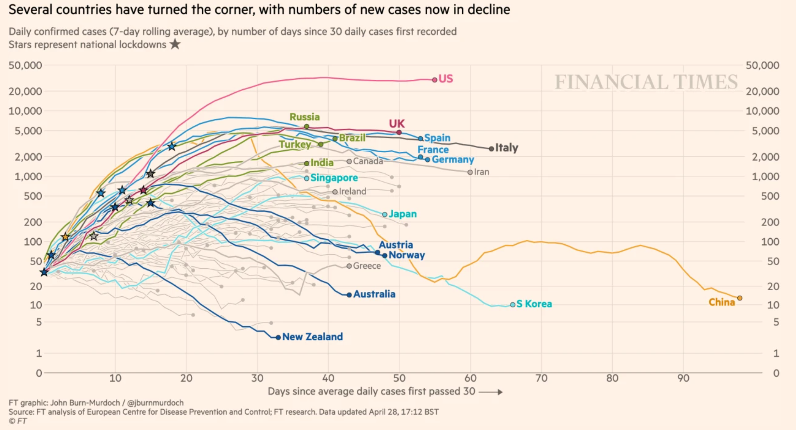
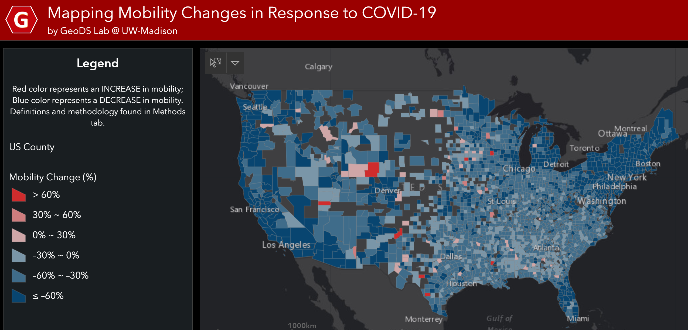
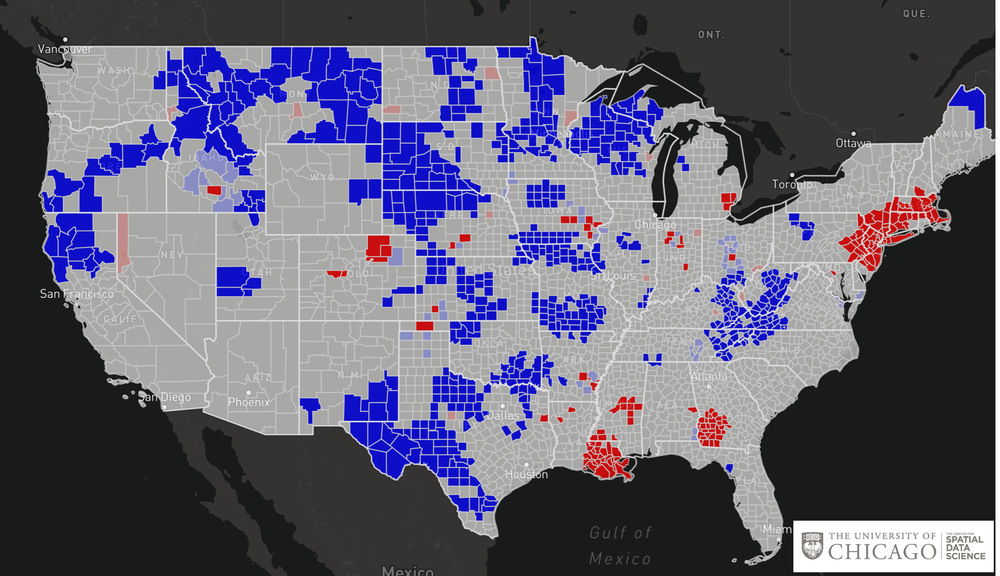
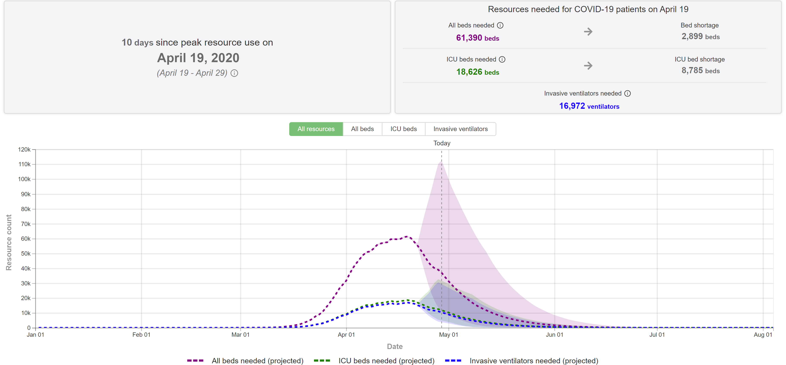

```{r setup, include=FALSE}
knitr::opts_chunk$set(echo=FALSE, 
                      comment=NA, 
                      warning=FALSE, 
                      message=FALSE, 
                      # cache = TRUE, 
                      fig.pos="H",
                      fig.width = 12)

library(tidyverse)
library(purrr)
library(lubridate)
library(zoo)
library(readxl)
library(maps)
library(sf)
library(plotly)
library(shiny)

# extra packages required by 'sf'
library(rgeos)
library(maptools)

```

<style>

.center-mid {
  position:          relative;
  top:               50%;
  transform:         translateY(30%);
}

.center-left {
  position:          relative;
  top:               50%;
  transform:         translateY(30%);
}
.center-right {
  position:          relative;
  top:               50%;
  transform:         translateY(30%);
}

.big-text {
  font-size: 26px;
  padding: 0.5em 0em 0em 0em;
  line-height: 1.9em;
}

.kinda-big-text {
  font-size: 24px;
  padding: 0.2em 0em 0em 0em;
}

</style>

# COVID-19

[Headline]

---

# COVID-19 Data Visualizations

<!-- [Screen Grab: FT, JHU, etc. (look at AFI DSI COVID-19 website)] -->

.pull-left[
  <center>
  
  <a href="https://www.ft.com/coronavirus-latest">https://www.ft.com/coronavirus-latest</a>
  </br>
  </br>
  
  <div style="width:400; word-wrap: break-word;">
    <a href="https://geods.geography.wisc.edu/covid19/physical-distancing">https://geods.geography.wisc.edu/covid19/physical-distancing</a>
  </div>
  </center>
]

.pull-right[
  <center>
    
    <a href="https://geodacenter.github.io/covid/map.html">https://geodacenter.github.io/covid/map.html</a>
    </br>
    </br>
    
    <a href="https://covid19.healthdata.org/united-states-of-america">https://covid19.healthdata.org/united-states-of-america</a>
  </center>
]

---

# New York Times Data Visualizations

<!-- [Screen Grab] -->
.pull-left[
  <center>
    
  
  </center>
]

.pull-right[
  <center>
    
    
  </center>
  <div style="width:300; word-wrap: break-word;">
    <https://www.nytimes.com/interactive/2020/04/03/upshot/coronavirus-metro-area-tracker.html>
  </div>
]

---
class: inverse 

# AFI DSI COVID-19 Research Group

.kinda-big-text[

  "*Wisconsin leaders need information about the extent and impact of COVID-19 to make good decisions.*" - [AFI DSI COVID-19 Research Group Charter](https://datascience.wisc.edu/covid19/covid19_charter/)
  
  **Project Idea**: "*Can we add value with visualizations of growth rates in Wisconsin metro areas?*" - [Steve Goldstein](https://biostat.wiscweb.wisc.edu/staff/goldstein-steve/)
  
  **Audience**: 
  - Wisconsin Public Health Officials
  - Health System Officials
  - Interested modelers and citizens

]


???

[Collaborator]

[Audience]

Goal: [Goal]


---

# Data Sources

.big-text[
- New York Times Database of U.S. Coronavirus Cases
- Corona Data Scraper Timeseries
- United States Census Bureau:
  - County Population Totals
  - Delineation Files
  - Cartographic Boundary Files
]


???

- Delineation files are for the geographic metro/micro regions (by county for aggregation)

---

# Exponential Spread of COVID-19

[Plot] 

---

# Growth Rate

.big-text[
Calculate [compound daily growth rate](https://en.wikipedia.org/wiki/Compound_annual_growth_rate):
]

\begin{equation}
\textrm{avg daily change}_t =  \left( \frac{\textrm{cases}_t}{\textrm{cases}_{t-7}} \right)^{(1/7)} - 1 
\end{equation}


.big-text[
Captures the <span style="color: #FF1B70;">relative spread</span> of Cornoavirus

Averaged over last 7 days

]


???

- Not an exact match to NYT visualizations, but was pretty close
- Averaged to account for changes in test results over weekends 
- Highly volatile for areas with small case counts, only plot those with >30 cases 


---

# Daily Growth Rate

[Plot] 

---

# Growth Rates by Case Count

[Plot] 

---

# Maps of Metro Areas

[Plot] 

---

# Maps of Metro Areas

[Plot] 

---

# Website

</br>
## [data-viz.it.wisc.edu/wi-metro-growth-rate/](https://data-viz.it.wisc.edu/wi-metro-growth-rate/)


.big-text[
- Daily updates to data
- Weekly updates summarizing key developments
]

.center[


]

???

[Sean Retrospective]
- Hosted on Rstudio Server through data-viz.it.wisc.edu
- Updates daily each afternoon with new data
- Hosting on new platform never easy, plenty of time and energy goes into these sorts of things
- Really matters to have a professional, public-facing way to display the results


---

# Wisconsin Dept. of Health Services

**Reka Sundaram-Stukel**

[Srikanth: Email]

---

# Wisconsin Dept. of Health Services

[Plot] 

---

# Wisconsin Dept. of Health Services

[Plot] 

---

# Gundersen Health System

**Corey Zarecki**

[Srikanth: Email]

---

# Gundersen Health System

[Plot] 

---

# Gundersen Health System

[Plot] 

---

# Future Work

[Split]

<!-- - Fit extended state-space SIR model with time-varying transmission rates using `eSIR` -->
- Effective reproduction rate of the virus $R_t$
- [Testing]

---
layout: false
class: inverse, center, middle

# **Thank You!**

[FiveThirtyEight Comic Strip: George Box Quote]
